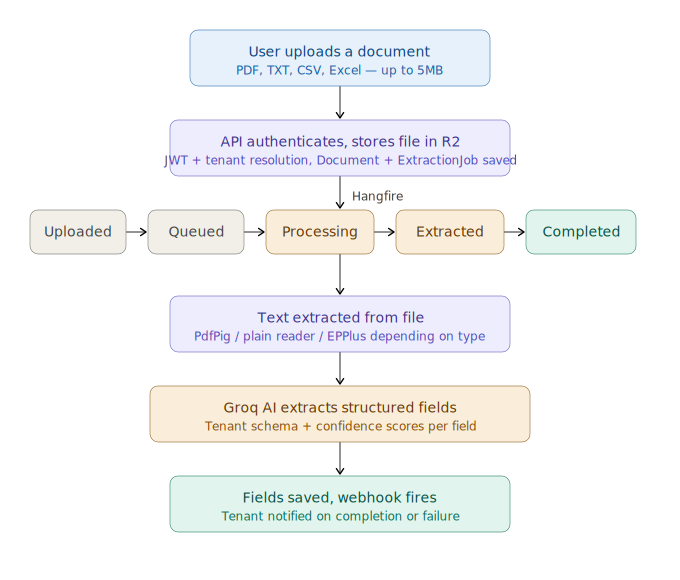

# DocuFlow

A multi-tenant document processing app built with .NET 10 and React. You upload an invoice, a contract, or a spreadsheet and the system handles the rest. It extracts structured data using AI entirely in the background, with each tenant's data kept completely separate at the database level.

Live demo: https://docuflow-sigma.vercel.app

## Screenshots

Dashboard

Overview of recent documents, extraction stats, and processing status across the tenant.

Document Upload

Upload a file and the system queues it immediately and begins processing in the background.

Extraction Results

Extracted fields with confidence scores, pulled from the document using Groq AI against a configurable schema.

## Architecture

The backend follows Clean Architecture with four layers. Domain sits at the core with no external dependencies, just entities, enums, and domain events. Application wraps it with CQRS handlers via MediatR and repository interfaces, defining what the system does without caring about how it is implemented. Infrastructure is where everything is wired up: EF Core repositories talking to PostgreSQL, Hangfire for background jobs, Cloudflare R2 for file storage, Groq for AI extraction, and MailKit for email. The API layer is the thin entry point handling controllers, JWT middleware, tenant resolution, and DI wiring.

## Document processing flow



When a file is uploaded the API stores it in Cloudflare R2 and creates an ExtractionJob in PostgreSQL. Hangfire picks up the job and walks the document through each status stage. Text is extracted based on the file type using PdfPig for PDFs, a plain reader for TXT and CSV, and EPPlus for Excel. The extracted text is then passed to Groq along with the tenant's configured schema. Fields and confidence scores are persisted once extraction is complete, and a webhook fires to notify the tenant on success or failure.

## Tech Stack

Backend

- .NET 10, ASP.NET Core
- Clean Architecture + CQRS + MediatR
- Entity Framework Core + PostgreSQL
- Hangfire (background jobs)
- JWT auth + multi-tenancy via EF Core global query filters

Frontend

- React 18 + TypeScript + Vite
- Tailwind CSS
- TanStack Query + React Hook Form + Zod

AI and Processing

- Groq API (field extraction)
- PdfPig, plain reader, EPPlus (file text extraction)
- Cloudflare R2 (file storage)
- MailKit (SMTP notifications)

Testing

- xUnit + WebApplicationFactory integration tests
- Unique in-memory DB per test instance to avoid state bleed

## Running Locally

Prerequisites: .NET 10 SDK, Node.js 18+, PostgreSQL

```bash
# Backend
cd src/DocuFlow.Api
dotnet run

# Frontend
cd src/DocuFlow.Web
npm install
npm run dev
```

Copy `appsettings.json` and fill in the following environment variables:

| Key                                    | Description                       |
| -------------------------------------- | --------------------------------- |
| `ConnectionStrings__DefaultConnection` | PostgreSQL connection string      |
| `Jwt__Secret`                          | JWT signing secret (min 32 chars) |
| `Groq__ApiKey`                         | Groq API key                      |
| `R2__AccountId`                        | Cloudflare R2 account ID          |
| `R2__AccessKeyId`                      | Cloudflare R2 access key          |
| `R2__SecretAccessKey`                  | Cloudflare R2 secret key          |
| `R2__BucketName`                       | R2 bucket name                    |
| `Email__SmtpHost`                      | SMTP host                         |
| `Email__Username`                      | SMTP username                     |
| `Email__Password`                      | SMTP password                     |
| `Cors__AllowedOrigins`                 | Frontend URL                      |

## Author

Arvind Chauhan, Software Developer, NZ
GitHub: https://github.com/jusarvind
LinkedIn: https://www.linkedin.com/in/arvind-chauhan-8279ba405/
