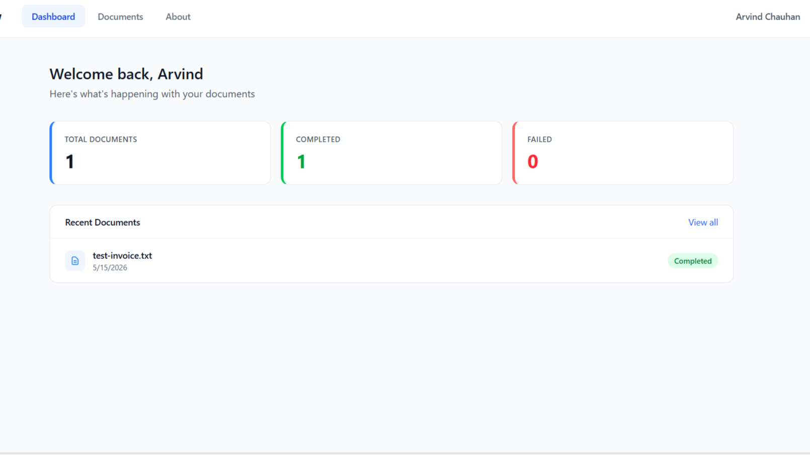
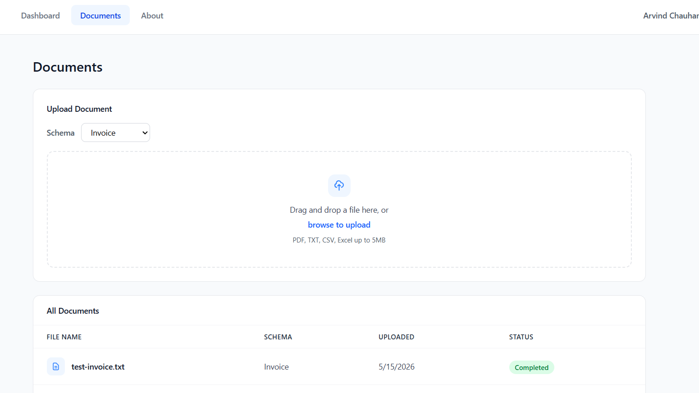
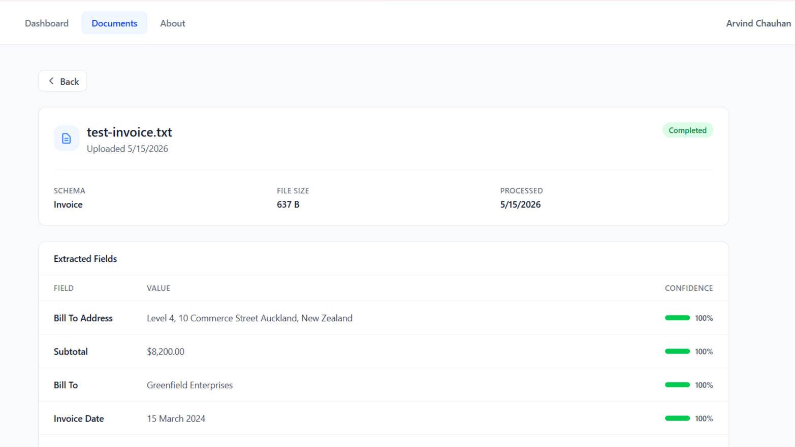

# DocuFlow

A multi-tenant document processing app built with .NET 10 and React. Upload a PDF or invoice, and the system extracts structured data from it using AI — automatically, in the background, with each tenant's data kept completely separate.

**Live demo:** https://docuflow-sigma.vercel.app

## Screenshots

**Dashboard**

_Overview of recent documents, extraction stats, and processing status across the tenant._

**Document Upload**

_Upload a PDF or invoice — the system queues it immediately and begins processing in the background._

**Extraction Results**

_Extracted fields with confidence scores, pulled from the document using Groq AI against a configurable schema._

## Architecture

Built on Clean Architecture with four layers. The **Domain** layer has no external dependencies — just entities, enums, and domain events. The **Application** layer sits on top and handles all the business logic through CQRS handlers (MediatR) and repository interfaces, with no knowledge of how things are actually implemented. The **Infrastructure** layer is where that implementation lives: EF Core + PostgreSQL, Hangfire for background jobs, Cloudflare R2 for file storage, Groq for AI, and MailKit for email. The **API** layer is just the entry point — ASP.NET Core controllers, JWT middleware, and DI wiring.

When a document gets uploaded, the API creates a `Document` and an `ExtractionJob`, stores the file in R2, and hands off to a Hangfire job. That job walks the document through `Uploaded → Queued → Processing → Completed`, using PdfPig to pull out the raw text and then Groq to extract structured fields against a configurable schema. Confidence scores are saved alongside each field, and a webhook fires when it's done (or if it fails).

## Tech Stack

**Backend**

- .NET 10, ASP.NET Core
- Clean Architecture + CQRS + MediatR
- Entity Framework Core + PostgreSQL
- Hangfire (background jobs)
- JWT auth + multi-tenancy via EF Core global query filters

**Frontend**

- React 18 + TypeScript + Vite
- Tailwind CSS
- TanStack Query + React Hook Form + Zod

**AI & Processing**

- Groq API (field extraction)
- PdfPig (PDF text extraction)
- Cloudflare R2 (file storage)
- MailKit (SMTP notifications)

**Testing**

- xUnit + WebApplicationFactory integration tests
- Unique in-memory DB per test instance to avoid state bleed

## Running Locally

**Prerequisites:** .NET 10 SDK, Node.js 18+, PostgreSQL

```bash
# Backend
cd src/DocuFlow.Api
dotnet run

# Frontend
cd src/DocuFlow.Web
npm install
npm run dev
```

Copy `appsettings.json` and fill in:

| Key                                    | Description                       |
| -------------------------------------- | --------------------------------- |
| `ConnectionStrings__DefaultConnection` | PostgreSQL connection string      |
| `Jwt__Secret`                          | JWT signing secret (min 32 chars) |
| `Groq__ApiKey`                         | Groq API key                      |
| `R2__AccountId`                        | Cloudflare R2 account ID          |
| `R2__AccessKeyId`                      | Cloudflare R2 access key          |
| `R2__SecretAccessKey`                  | Cloudflare R2 secret key          |
| `R2__BucketName`                       | R2 bucket name                    |
| `Email__SmtpHost`                      | SMTP host                         |
| `Email__Username`                      | SMTP username                     |
| `Email__Password`                      | SMTP password                     |
| `Cors__AllowedOrigins`                 | Frontend URL                      |

## Author

Arvind Chauhan — Software Developer, NZ
[GitHub](https://github.com/jusarvind) · [LinkedIn](https://www.linkedin.com/in/arvind-chauhan-8279ba405/)
